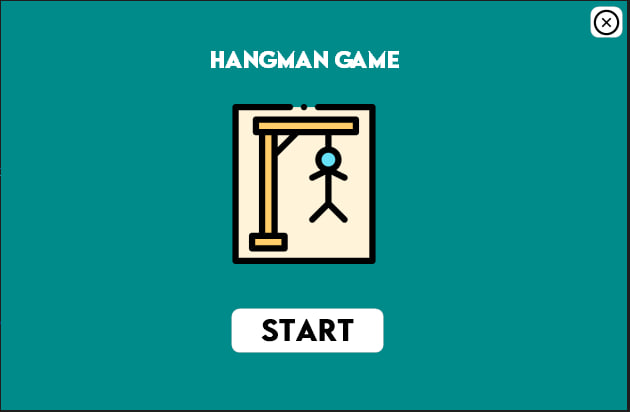
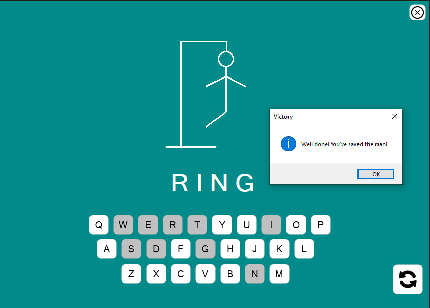
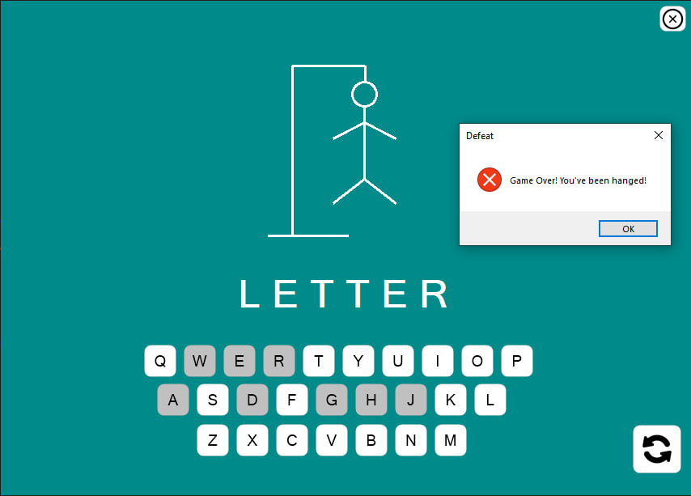
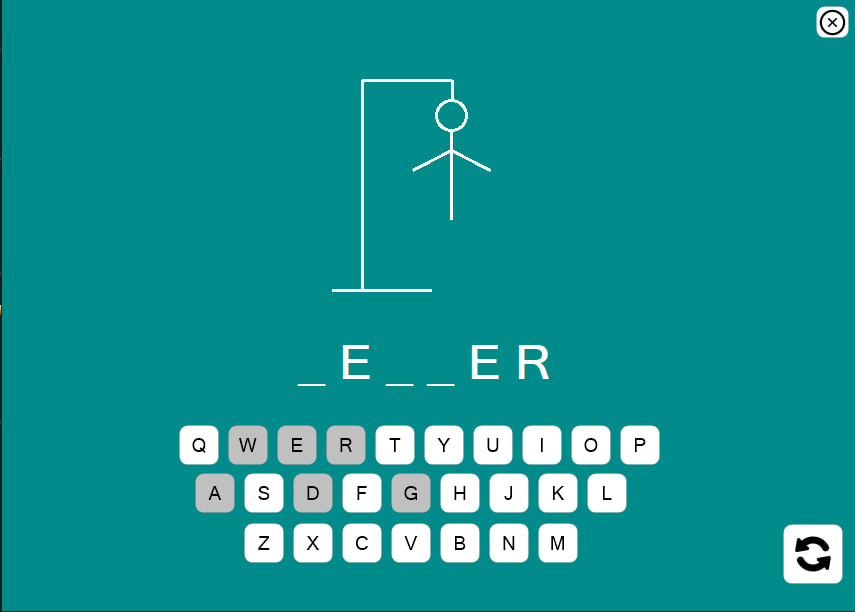

# 🎮 Hangman Game

A Windows Forms Hangman game built with **C#**. Save the man from the gallows by guessing the hidden word before it's too late!

## 📸 Game Preview

### Start Screen

### Correct Guess

### Wrong Guess

### Game In Progress

## 🕹️ How to Play
- A secret word is chosen randomly
- Guess one letter at a time
- Every wrong guess draws a part of the gallows
- Save the man by guessing the full word correctly before the gallows is complete
- Run out of guesses and the man is hanged — you lose!

## 🚀 How to Run
- Clone the repository
- Open in Visual Studio 2022
- Press `Ctrl + F5` to run

## 🛠️ Technologies
- C#
- .NET
- Windows Forms (WinForms)

## 👨‍💻 Author
- Name: [Waleed Ehab](https://github.com/WaleedEhab)
